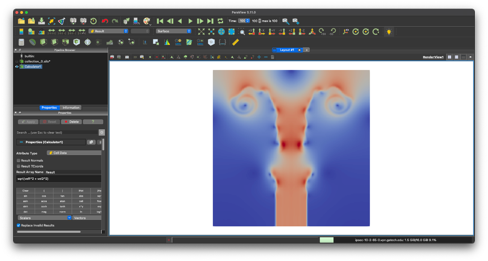
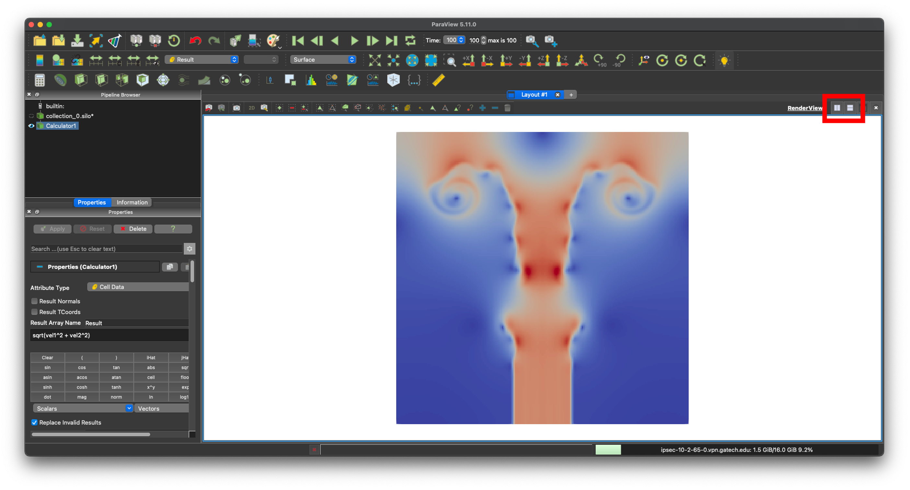
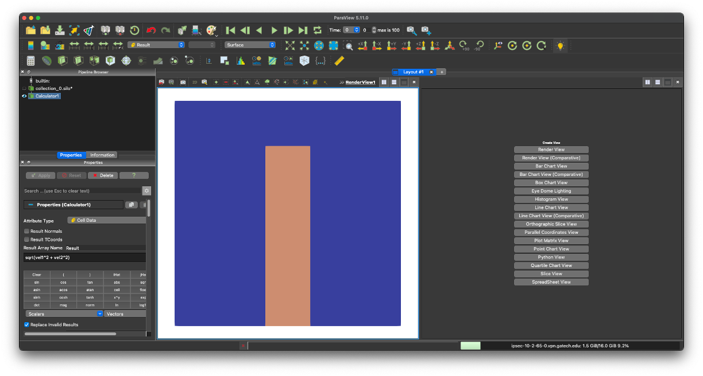

# Creating an Annimation
Annimations (videos) are a nice way to show the evolution of transient data over time.
This tutorial assumes that you have already opened a dataset that has multiple snapshots in time, selected a colorbar for your data, and performed the steps in [Three Steps to Nicer Visualization](three-steps-to-nice-visualization.md).

## Step 1 - Frame your data
If  your data doesn't fill the render view in Paraview, it won't fill the video frame in your video.
The easiest way to make your data fill the frame is to click the Reset Camera Closest or Zoom Closest to Data buttons.


For the data used in this tutorial, the resulting render view is shown below.



To fill the render view horizontally, split the viewing area in half by clicking Split Horizontal Axis and drag the separation line to the desired position.
If your data fills the render view horizontally but not vertically, you can use Split Vertical Axis instead.
These buttons are to the top and right of the render view as shown below.



Once you have your data framed in a way you like, move on to Step 2 to save screenshots of each snapshot in your data.
An example of well framed data is shown below.



## Step 2 - Export Snapshots
Once your data is framed, you can save screenshots by clicking `file -> Save Annimation...`.
Once you give a filename, the following popup appears with a few usefull options.


The following options let you control how Paraview saves snapshots:

- Image Resolution: As the name implies, this is the resolution the snapshots are saved at.
To preserve your well framed data, the ratio of pixels in each direction must stay the same.
It is also helpful to use an even number of pixels in both directions.
This makes post processing the images created by Paraview easier.

- Override Color Palette: This gives you a few options for background colors.

- Transparent Background: This creates images with transparent backgrounds.
For still images, this feature works as expected.
However, FFMPEG will add a background to transparent images when they are formed into a video.
If you need a video with a transparent background, the easiest thing to do is set the background color in Paraview to match whatever the image will be placed on.

The rest of the options can generally be left unchanged. 
Once you have a directory with a bunch of pictures in it, proceed to step 3.

## Step 3 - Merge Snapshots into a Video

Navigate to the directory in which you saved the snapshots.
You'll see all of the images with numbers appended to them indicating their frame number. 
For example, (`pic.00001.png`, `pic.00002.png`, ...) 

```ffmpeg -r 30 -f image2 -i <filename>.%04d.png -vcodec libx264 -crf 25 -pix_fmt yuv420p test.mp4```

The inputs are:

- `-r` is the framerate

- `crf` is the quality, lower means better quality

- `-S` (optional) video resolution in pixels

- `-pix_format` specifies the pixel format

For additional details on the basics of FFMPEG, see the FFMPEG Cheat Sheet tab [Here](https://benwilfong.com)
